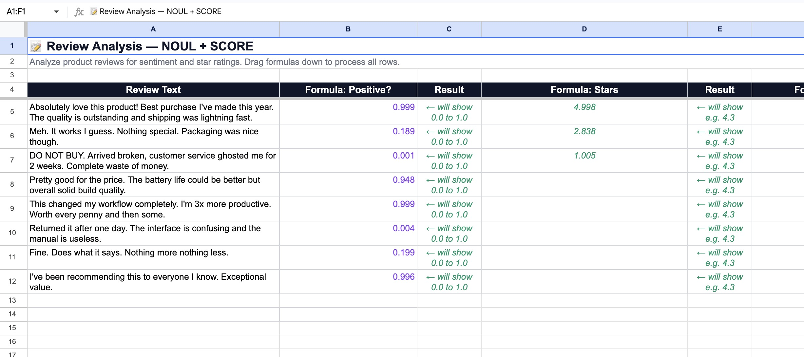

# TypeSafe AI — Google Sheets Add-on

Bring AI-powered text evaluation and classification directly into your spreadsheets. Analyze customer reviews, survey responses, content quality, and more using deterministic AI models as native custom functions.

---

## Features

- **6 custom spreadsheet functions** for semantic analysis, classification, and scoring
- **Confidence metrics** — know how certain the model is about each result
- **Probability distributions** — see the full breakdown across classification options
- **Smart caching** — identical inputs are cached for 6 hours to minimize API costs
- **Simple setup** — configure your API key once via the sidebar, then start using functions immediately

---

## Installation

1. Open a Google Sheet
2. Go to **Extensions → Apps Script**
3. Copy the contents of `Code.gs` into the script editor
4. Copy `Sidebar.html` into a new HTML file named `Sidebar`
5. Copy `appsscript.json` into the manifest (enable "Show appsscript.json manifest file" under Project Settings)
6. Save and reload your spreadsheet
7. A **TypeSafe AI** menu will appear in the menu bar

---

## Configuration

1. Click **TypeSafe AI → ⚙️ Settings** in the menu bar
2. Enter your [TypeSafe AI API key](https://typesafe.ai)
3. Select a model from the dropdown
4. Click **Save**
5. Use **TypeSafe AI → 🧪 Test connection** to verify everything is working

Your API key is stored securely using Google's user properties service (encrypted, per-user).

---

## Custom Functions

### `NOUL(text, instruction)`

Returns the probability (0–1) that a yes/no statement is true about the text.

```
=NOUL(A1, "This review is positive")
→ 0.87
```

---

### `NOUL_C(text, instruction)`

Same as `NOUL`, but returns two columns: **[probability, confidence]**.

```
=NOUL_C(A1, "This review is positive")
→ 0.87  |  0.92
```

---

### `CHOICE(text, instruction, options)`

Classifies text into one of several pipe-separated options.

```
=CHOICE(A1, "Classify the sentiment", "positive|negative|neutral")
→ "positive"
```

Options can include descriptions:
```
=CHOICE(A1, "Classify urgency", "high:Needs immediate action|medium:Can wait a day|low:No rush")
→ "high"
```

---

### `CHOICE_C(text, instruction, options)`

Same as `CHOICE`, but returns two columns: **[chosen option, confidence]**.

```
=CHOICE_C(A1, "Classify the sentiment", "positive|negative|neutral")
→ "positive"  |  0.78
```

---

### `CHOICE_DIST(text, instruction, options)`

Returns the full probability distribution across all options as separate columns.

```
=CHOICE_DIST(A1, "Classify the sentiment", "positive|negative|neutral")
→ 0.72  |  0.15  |  0.13
       positive  negative  neutral
```

Use this when you need nuance beyond a single classification.

---

### `SCORE(text, instruction, levels)`

Scores text on a numeric scale. Levels are defined as `number:description` pairs.

```
=SCORE(A1, "Rate the helpfulness of this response", "1:Not helpful at all|3:Somewhat helpful|5:Extremely helpful")
→ 3.72
```

Returns the expected value across all levels, so the result can be fractional.

---

### `SCORE_C(text, instruction, levels)`

Same as `SCORE`, but returns two columns: **[expected value, confidence]**.

```
=SCORE_C(A1, "Rate the helpfulness of this response", "1:Not helpful at all|3:Somewhat helpful|5:Extremely helpful")
→ 3.72  |  0.85
```

---

## Options & Levels Format

| Format | Example |
|--------|---------|
| Simple options | `"approve\|reject\|escalate"` |
| Options with descriptions | `"approve:Meets all criteria\|reject:Does not qualify\|escalate:Needs review"` |
| Levels (sparse OK) | `"1:Terrible\|5:Excellent"` — 2, 3, 4 are interpolated |
| Levels with all steps | `"1:Poor\|2:Fair\|3:Good\|4:Very good\|5:Excellent"` |

---

## Example



*Analyzing product reviews with `NOUL` for sentiment probability and `SCORE` for star ratings — drag formulas down to process all rows.*

---

## Example Use Cases

**Sentiment analysis on customer reviews:**
```
=CHOICE(B2, "What is the overall sentiment?", "positive|negative|neutral")
```

**Spam detection:**
```
=NOUL(C5, "This message is spam or promotional")
```

**Support ticket urgency scoring:**
```
=SCORE(D8, "How urgent is this support request?", "1:Low priority|3:Normal|5:Critical")
```

**Content quality check with confidence:**
```
=CHOICE_C(E3, "Is this writing professional?", "yes|no|borderline")
```

**Full distribution for nuanced classification:**
```
=CHOICE_DIST(F2, "Categorize this feedback", "bug|feature request|praise|question")
```

---

## Menu Options

| Menu Item | Description |
|-----------|-------------|
| ⚙️ Settings | Open sidebar to configure API key and model |
| 🧪 Test connection | Verify API key and list available models |
| 📖 Help | View help documentation |

---

## Notes

- Results are cached per-user for **6 hours**. If you change your model or want to re-evaluate, clear the cache from the sidebar.
- Functions that return multiple columns (e.g., `NOUL_C`, `CHOICE_C`, `SCORE_C`, `CHOICE_DIST`) must be entered in a cell with enough adjacent empty columns to the right.
- API keys are stored per Google account and are not shared with other users of the same spreadsheet.

---

## License

See [LICENSE](../LICENSE) in the root of this repository.
